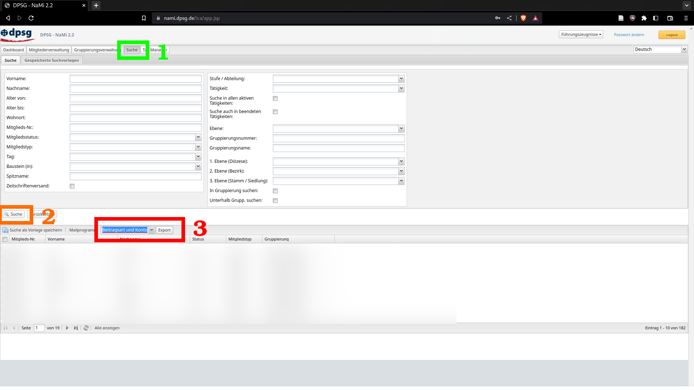
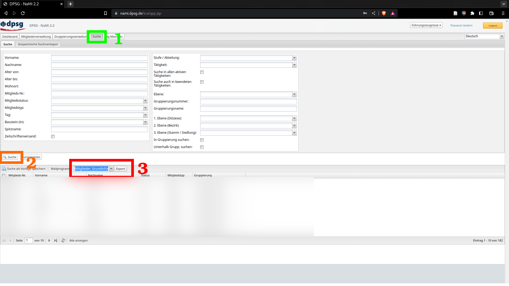

# NaMi2SEPA

NaMi2SEPA ermoeglicht einfaches Generieren von SEPA-Lastschriften aus NaMi-Exports.
Wichtige Informationen sind in Konfigurations-Dateien ausgelagert, die einfach angepasst werden koennen.

## Installation
Fuehre den folgenden Befehl aus, um das Tool mit dem pip-package manager zu installieren:
````shell
pip install 'git+https://github.com/dennisschneider-ml/dpsg-NaMi2SEPA.git'
````

Die Deinstallation erfolgt mit dem folgenden Befehl:
````shell
pip uninstall nami2sepa
````

## Vereinsspezifische Konfiguration
Lege die Dateien unter ``config/`` auf deinem lokalen Computer unter ``.config/nami2sepa/`` ab.
Erstelle das Verzeichnis, wenn es noch nicht vorhanden ist. \
Fuelle die ``sepa_config.json`` mit den SEPA-Informationen deines Vereins.
Des Weiteren ist in demselben Ordner eine ``Sepa_Informations.xlsx``.
Da die Bank das Datum der Erstlastschrift sowie der SEPA-Unterschrift benoetigt und diese Informationen nicht im NaMi hinterlegbar sind, muss diese Liste manuell gefuehrt werden.

## Nutzung
Um einen SEPA-Lastschrift Einzug zu taetigen, exportiere die files ``Mitglieder: Grundinformationen mit Taetigkeiten und Stufe Abteilung`` und ``Beitragsart und Kontoverbindung`` aus dem NaMi und lege sie in einem Ordner ab, z.B. in ``~/sommerlager``:




Navigiere zu den heruntergeladenen Dateien und fuelle die Aktions-Datei aus (siehe nachstes Kapitel).
Starte das Tool.
````shell
nami2sepa
````
Das Tool erkennt die exportierten files automatisch.
Natuerlich koennen die files auch manuell eingegeben werden:
````shell
nami2sepa -a <Pfad zur Kontoverbindungs-Datei> -t <Pfad zur Taetigkeiten-Datei> -i <Pfad zur SEPA-Informations Datei (nicht aus NaMi)> -p <Pfad zur Aktions-Datei>
````
Alle weiteren Kommandozeilen-Argumente koennen in der Hilfe nachgelesen werden: ``nami2sepa -h``.

## Die Aktions-Datei

Diese json-Datei beinhaltet die Aktions-spezifischen Informationen:
````json
{
    "Verwendungszweck": "Sommerlager 2099 {Nachname}, {Vorname}",
    "end2end-id": "kurzeIdentifikationDieserSammelLastschrift",
    "Beitragsinformationen":
        "MitgliedernummernVonBeteiligten": BetragInEuro,
        "123456": 5.99,
        "654321": 4
}
````
Der Verwendungszweck gibt den Verwendungszweck an, wie er bei den Einzelpersonen im Einzug angegeben wird. Dieseer wird individualisiert durch das automatische Einsetzen der Variablen ``{Vorname}`` und ``{Nachname}``. \
Die end2end-id identifiziert jede Sammellastschrift. Zum Beispiel ``sommerlager2099``. \
Die Beitragsinformationen koennen leer gelassen werden. In diesem Fall werden alle aktiven Mitglieder des Stammes einbezogen und der automatisch generierte Betrag (abhaengig von der momentan aktiv ausgeuebten Taetigkeit, siehe naechstes Kapitel) wird eingezogen. Dies ist gedacht fuer die halbjaehrlichen Mitgliederbeitraege.
Wird das Feld nicht leer gelassen, kann man die Mitgliedernummern der betroffenen Personen angeben, gemeinsam mit dem Betrag. Dies ist gedacht fuer das gezielte Einziehen nach Aktionen.

## Automatische Beitrags-Berechnung

Da in NaMi die Taetigkeiten der einzelnen Mitglieder protokolliert sind, werden folgende Beitragsstufen unterschieden:
- Sozialtopf (werden vom Einzug ignoriert und die betroffenen Mitglieder-Identifikationen ausgegeben. Dies muss auf manuellem Weg erfolgen.)
- Mitglied (Voller Beitrag)
- Mitglied (Familien Beitrag)
- Leiter
- Alumni/Aktive Mitglieder (Manuell in ``~/.config/nami2sepa/Sepa_Informations.xlsx`` gefuehrt.)

## Automatische Projekt-Kalkulations Erstellung

[WIP] \
Aus einer Excel-Datei mit Namen soll (tolerant gegenueber typos, Umlauten, partielle Anaben von mehreren Vor-/Nachnamen) das zugehoerige Mitglied gefunden werden und in die ``project_file.json`` eingetragen werden.

## Automatische Erstellung von Projekt-Einzuegen

[WIP] \
Der folgende Befehl soll einen Ordner mit zugehoerigen files erstellen:
````shell
nami2sepa new <aktionsname>
````
